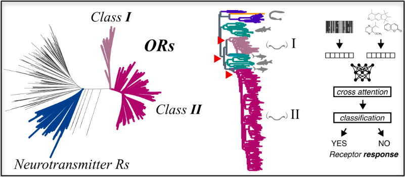

# Olfactory receptors

Source code for the analysis of predicted olfactory receptor–odorant interactions across
the human OR repertoire and its reconstructed ancestors.



A model trained on measured receptor–odorant bioassays predicts a binding probability for
every receptor × odorant pair. This repository takes those probabilities and asks what they
say — about the 433 extant human receptors, about 432 reconstructed ancestral nodes, and
about how odour chemistry sits inside natural-product chemical space.

| | |
|---|---|
| receptors | **433** human ORs (reference tree), **432** reconstructed ancestral nodes |
| odorants | **754** molecules with measured M2OR data |
| measured pairs | **23,782** human receptor × odorant pairs, used to calibrate everything |
| model output | 5 independent runs → per-pair **median probability** |
| representations | ESM-C 300M protein embeddings (960-d), MolFormer ligand embeddings (768-d) |

---

## Quickstart

```bash
git clone https://github.com/cgenomicslab/olfactory-receptors.git
cd olfactory-receptors

# 1. environment  (~10 min; mamba is much faster than conda)
conda env create -f environment.yml
conda activate olfactory-receptors

# 2. data that is too large for Git  (~50 MB by default)
python scripts/download_zenodo_data.py

# 3. check the clone is complete before running anything
python scripts/check_reproducibility.py

# 4. start reading
#    Downstream_Analysis/notebooks/reference_tree/01.model_behaviour.ipynb
```

Step 2 fetches the prediction matrices and the pooled embeddings from Zenodo and verifies
each archive's SHA-256 against `zenodo_manifest.json`. The multi-GB per-residue embedding
archives are opt-in — `--assets all` if you want them, but nothing in the analysis needs
them.

---

## What is where

```
Data/                      M2OR bioassay pairs, as downloaded, plus an EDA notebook
Model/
  Data_Preparation/        M2OR -> the modelling table (sequence IDs, SMILES IDs, classes)
  Embeddings/              ESM-C protein and MolFormer ligand embeddings
Phylogenetic_Analysis/     trees: class A GPCRs, six species, the 433 human ORs
Ancestral_Receptor_
  Reconstruciton/          IQ-TREE ancestral state reconstruction, and the rooted tree
Chemicals/
  odor_datasets/           odour descriptors per molecule
  chemspace/               odorant chemistry against a natural-product background
Downstream_Analysis/       what the predictions say            <- start here
  notebooks/reference_tree/  the 433 extant human receptors
  notebooks/ancestral/       the 432 reconstructed nodes
  scripts/                   shared code the notebooks import
  predictions/               the probability matrices (from Zenodo, not Git)
scripts/                   data download and clone verification
```

Every analysis folder has its own README explaining its variables and how to run it.
**[`Downstream_Analysis/README.md`](Downstream_Analysis/README.md) is the one to read first.**

---

## The data flow

```
   M2OR bioassays                        odorant SMILES
   (52,176 pairs)                        (754 molecules)
         |                                      |
         v                                      v
  receptor sequences  --> ESM-C 300M      MolFormer
         |                (960-d)          (768-d)
         |                    \              /
         |                     \            /
   Phylogenetic_Analysis         [ binding model ]  -- 5 runs
   433 human ORs                        |
         |                              v
         v                    median probability per pair
   Ancestral_Receptor_               /        \
   Reconstruciton         ASR matrix          reference matrix
   432 nodes              (432 x 754)         (584 x 754)
                                   \          /
                                    v        v
                              Downstream_Analysis
```

**The binding model itself is not in this repository.** This repo covers everything up to
the model input and everything downstream of its output; the training code lives separately.
<!-- TODO: replace this line with the URL / DOI of the model repository before submission. -->

---

## The path contract

**Every path in this repository is relative to the repository root. Nothing is absolute.**
`scripts/check_reproducibility.py` enforces this — it scans every `.py` and `.ipynb` and
fails if it finds a path that only exists on one machine.

That only works if the data downloaded from Zenodo lands exactly where the code expects it.
It does: each archive in `zenodo_manifest.json` carries a `destination`, and
`download_zenodo_data.py` extracts it there, so the internal layout of the ZIP plus the
destination reproduces the directory tree the code already reads from.

| archive | extracts into | giving |
|---|---|---|
| `..._downstream_probabilities` | `Downstream_Analysis/predictions/` | `predictions/aggregated/<Category>/<matrix>.csv`, `predictions/runs/…` |
| `..._molecule_embeddings` | `Model/Embeddings/` | `Embeddings/molecules/molformer_smiles_embeddings.pt` |
| `..._protein_embeddings_pooled` | `Model/Embeddings/proteins/` | `proteins/pooled/<dataset>_esmc300m_pooled.npy` |
| `..._protein_embeddings_gpcr` | `Model/Embeddings/proteins/` | `proteins/gpcr_esmc_300m_embeddings/<id>.npy` |
| `..._protein_embeddings_m2or` | `Model/Embeddings/proteins/` | `proteins/m2or_esmc_300m_embeddings/<id>.npy` |
| `..._protein_embeddings_reference_tree` | `Model/Embeddings/proteins/` | `proteins/reference_tree_esmc_300m_embeddings/<id>.npy` |

So after `python scripts/download_zenodo_data.py --assets all`, the tree is byte-for-byte
the layout the notebooks were written against, and every relative path resolves.

**If you ever repackage an archive, keep its internal prefix and its `destination` in step.**
Changing either breaks every path downstream of it, silently — the notebook will just report
a missing file. `scripts/check_reproducibility.py` is the fastest way to catch it.

---

## Where the numbers come from

Two conventions run through the whole analysis. Both are worth understanding before reading
any figure.

**Probabilities are turned into binding calls by a density fill, not by a chosen threshold.**
The model emits probabilities; deciding what counts as "binds" needs a rule.
[`Downstream_Analysis/scripts/calibration.py`](Downstream_Analysis/scripts/calibration.py)
separates two questions — *how many* cells should be on is answered by isotonic calibration
against the 23,782 measured pairs, and *which* cells are on is answered by rank. The
resulting cut is an **output** of the procedure, never an input. It lands at 0.8875 on the
ancestral matrix and 0.8947 on the extant one.

**The rate-matched cut of 0.9150 is a reporting number, not a construction number.** It is
the operating point at which the predicted binding proportion equals the measured one, and
it is what the confusion matrix and per-pair metrics in `01.model_behaviour` are computed
at. It is *not* used to fill any matrix, because recall there is ~0.6.

**Joins are on biology, never on identifiers.** Receptors join by exact amino-acid sequence,
so M2OR mutants never fold onto wild-type predictions. Molecules join on an InChIKey RDKit
recomputes from SMILES, so a database release bump cannot silently break a join.

---

## Reproducing

Nothing here needs a GPU. The two steps that can use one —
`Chemicals/chemspace/s02_embed.py` and the `Model/Embeddings/extract_embeddings_*`
notebooks — regenerate data that is already published on Zenodo, so they are optional.

| I want to… | do this |
|---|---|
| re-run the downstream analysis | download the Zenodo data, run the notebooks in numbered order |
| rebuild the median matrices from the 5 runs | `python Downstream_Analysis/scripts/aggregate_prediction_runs.py` |
| re-run the chemical-space analysis | see [`Chemicals/chemspace/README.md`](Chemicals/chemspace/README.md) — needs a 700 MB COCONUT download |
| regenerate the embeddings | see [`Model/Embeddings/`](Model/Embeddings/) — needs a GPU and ESM-C |
| publish a new data release | see the Zenodo section in [`Downstream_Analysis/README.md`](Downstream_Analysis/README.md) |

Run `python scripts/check_reproducibility.py` at any point; it reports which inputs are
present, which are missing, and which command fetches each missing one.

---

## Citing

Data assets are archived on Zenodo — record ID and per-asset SHA-256 checksums in
[`zenodo_manifest.json`](zenodo_manifest.json). Code is released under the terms in
[`LICENSE`](LICENSE).
