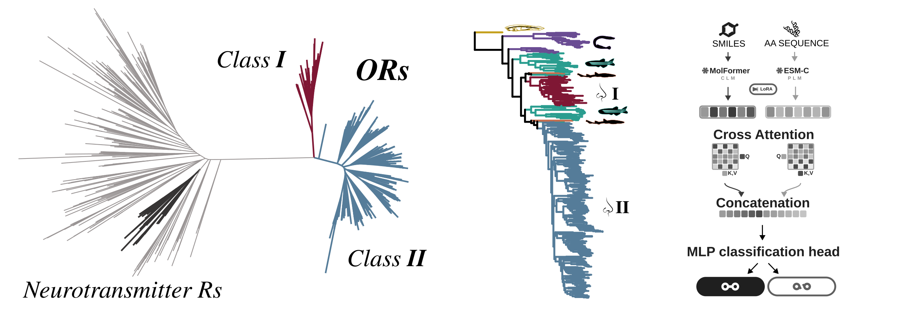

# Olfactory receptors

Code for **"Gene duplication shaped the origin and evolution of the vertebrate olfactory
combinatorial code."**

A model trained on measured receptor–odorant bioassays predicts a binding probability for
every receptor × odorant pair. This repository takes those probabilities and asks what they
say — about the 433 living human receptors, about 432 reconstructed ancestors, and about
where odour chemistry sits in natural-product space.



---

## Start here — one notebook per figure

Every notebook stores its figures inline, so you can read the whole analysis by scrolling
on GitHub without installing or running anything.

| | Notebook | What it answers |
|---|---|---|
| **Figure 1** | [Receptor phylogeny](Phylogenetic_Analysis/notebooks/figure1_receptor_phylogeny.ipynb) | Are olfactory receptors one clade, and when did their two classes split? |
| **Figure 2** | [The activation code](Downstream_Analysis/notebooks/reference_tree/figure2_activation_code.ipynb) | Do molecules read by similar receptors smell alike? |
| **Figure 3** | [Ancestral origin](Downstream_Analysis/notebooks/ancestral/figure3_ancestral_origin.ipynb) | When did the combinatorial code appear? |
| **Figure 4** | [Chemical space](Chemicals/chemspace/figure4_chemical_space.ipynb) | Where do odorants sit among natural products? |

---

## Every notebook, and what it produces

### The paper

| Notebook | Builds | Needs |
|---|---|---|
| [`figure1_receptor_phylogeny`](Phylogenetic_Analysis/notebooks/figure1_receptor_phylogeny.ipynb) | Figure 1, Extended Data Fig. 1 | embeddings |
| [`figure2_activation_code`](Downstream_Analysis/notebooks/reference_tree/figure2_activation_code.ipynb) | Figure 2, Table 1, Extended Data Figs 2–4 | predictions |
| [`figure3_ancestral_origin`](Downstream_Analysis/notebooks/ancestral/figure3_ancestral_origin.ipynb) | Figure 3, Extended Data Figs 5–6 | predictions |
| [`figure4_chemical_space`](Chemicals/chemspace/figure4_chemical_space.ipynb) | Figure 4, Extended Data Fig. 7 | chemical space |

### Supporting analyses

Real analyses the paper draws on, but which have no figure of their own.

| Notebook | Asks |
|---|---|
| [`model_errors`](Downstream_Analysis/notebooks/reference_tree/model_errors.ipynb) | where does the model get it wrong, and do the errors have structure? |
| [`barcode_perception`](Downstream_Analysis/notebooks/reference_tree/barcode_perception.ipynb) | do molecules with identical receptor barcodes smell the same? With a chemical-similarity control |
| [`biosynthetic_pathways`](Downstream_Analysis/notebooks/reference_tree/biosynthetic_pathways.ipynb) | do the activation clusters line up with biosynthetic origin? |

### Building the inputs

How the data the four figure notebooks read was made. You do not need to run these — their
outputs are committed or on Zenodo.

| Notebook | Makes |
|---|---|
| [`data`](Data/data.ipynb) | exploration of the raw M2OR export: coverage, balance, missingness |
| [`extract_pairs`](Model_Inputs/Data_Preparation/extract_pairs.ipynb) | the modelling table — 52,175 filtered observations |
| [`smiles_to_odors_pyrfume`](Chemicals/smiles_to_odors_pyrfume.ipynb) | the odour-descriptor tables, from pyrfume |
| [`extract_embeddings_GPCR`](Model_Inputs/Embeddings/extract_embeddings_GPCR.ipynb) | ESM-C embeddings, 722 class A GPCRs — and the Fig. 1b map |
| [`extract_embeddings_reference_tree`](Model_Inputs/Embeddings/extract_embeddings_reference_tree.ipynb) | ESM-C embeddings, 584 six-species proteins — and the Fig. 1d map |
| [`extract_embeddings_m2or`](Model_Inputs/Embeddings/extract_embeddings_m2or.ipynb) | ESM-C embeddings, 1,399 assayed proteins |
| [`human_hagfish_tree`](Ancestral_Receptor_Reconstruction/human_tree_asr_hagfish_outgroup/human_hagfish_tree.ipynb) | the rooted tree the ancestral reconstruction runs on |
| [`human_hagfish_asr`](Ancestral_Receptor_Reconstruction/human_tree_asr_hagfish_outgroup/human_hagfish_asr.ipynb) | the 432 reconstructed ancestral sequences |

The `extract_embeddings_*` notebooks need a GPU and the `esm` package. Everything else runs
on a laptop.

---

## The numbers

| | |
|---|---|
| receptors | **433** living human ORs, **432** reconstructed ancestors |
| odorants | **754** molecules with measured M2OR data |
| measured pairs | **23,782** human receptor × odorant pairs |
| model output | 5 independent runs → per-pair **median probability** |
| representations | ESM-C 300M proteins (960-d), MolFormer ligands (768-d) |

---

## Running it

```bash
git clone https://github.com/cgenomicslab/olfactory-receptors.git
cd olfactory-receptors

conda env create -f environment.yml         # ~10 min
conda activate olfactory-receptors

python scripts/download_zenodo_data.py      # data too large for Git (~50 MB)
python scripts/check_reproducibility.py     # says what is present and what is missing
```

Then open any notebook above and run it top to bottom.

---

## Reproducing

**The downstream analysis needs no GPU.** Everything under `Downstream_Analysis/` runs on
a laptop once the Zenodo data is downloaded — that is the bulk of the work and the part
most people will want.

**The chemical-space analysis needs a GPU.** `Chemicals/chemspace/s02_embed.py` embeds
730,000 molecules with MolFormer and refuses to run on CPU, and its output is too large to
archive. Without a GPU that analysis cannot be reproduced. This is a deliberate limit, not
an oversight.

| I want to… | do this | GPU |
|---|---|---|
| re-run the downstream analysis | download the Zenodo data, run `figure2_activation_code` and `figure3_ancestral_origin` | no |
| rebuild the median matrices from the 5 runs | `python Downstream_Analysis/scripts/aggregate_prediction_runs.py` | no |
| re-run the chemical-space analysis | see [`Chemicals/chemspace/README.md`](Chemicals/chemspace/README.md) — also needs a 700 MB COCONUT download | **yes** |
| rebuild just the chemical-space figures | `python Chemicals/chemspace/s11_paper_figures.py` | no |
| regenerate the protein embeddings | see [`Model_Inputs/Embeddings/`](Model_Inputs/Embeddings/) — or just download them | optional |
| audit the ancestral reconstruction | `python scripts/download_zenodo_data.py --assets asr_node_runs` | no |
| rebuild the Extended Data figures | `python scripts/build_extended_figures.py --out <dir>` | no |
| rebuild the Supplementary Tables | `python scripts/build_supplementary_tables.py --out <dir>/Supplementary_Tables.xlsx` | no |
| publish a new data release | see the Zenodo section in [`Downstream_Analysis/README.md`](Downstream_Analysis/README.md) | no |

Run `python scripts/check_reproducibility.py` at any point; it reports which inputs are
present, which are missing, and which command fetches each missing one.

---

## What is where

```
Data/                  the M2OR bioassay pairs, as downloaded
Model_Inputs/          what the model reads: the modelling table, and the embeddings
Phylogenetic_Analysis/ alignments and trees                          <- Figure 1
Ancestral_Receptor_
  Reconstruction/      the 432 reconstructed ancestral sequences
Downstream_Analysis/   what the predictions say                      <- Figures 2 and 3
Chemicals/chemspace/   odorants against a natural-product background <- Figure 4
scripts/               download, checks, and the figure/table builders
```

**The binding model itself is not here.** This repository covers its inputs and everything
downstream of its output. The training code lives separately.
<!-- TODO: replace with the URL / DOI of the model repository before submission. -->

---

## Two things to know before reading any figure

**Binding calls come from a density fill, not a chosen cut-off.** The model gives
probabilities; deciding what counts as "binds" needs a rule.
[`calibration.py`](Downstream_Analysis/scripts/calibration.py) splits that in two: *how
many* cells should be on is answered by calibration against the 23,782 measured pairs, and
*which* ones by rank. The cut is therefore an output, never an input. It lands at 0.8875 on
the ancestral matrix and 0.8947 on the living one.

**Joins are on biology, never on identifiers.** Receptors join by exact amino-acid
sequence, so M2OR mutants never fold onto wild-type predictions. Molecules join on an
InChIKey recomputed from SMILES, so a database update cannot silently break a join.

---

## Data and citation

Large files are archived on Zenodo at
[10.5281/zenodo.22178953](https://doi.org/10.5281/zenodo.22178953), with a SHA-256 for each
in [`zenodo_manifest.json`](zenodo_manifest.json). `download_zenodo_data.py` checks them on
arrival.

Code is released under [`LICENSE`](LICENSE).
