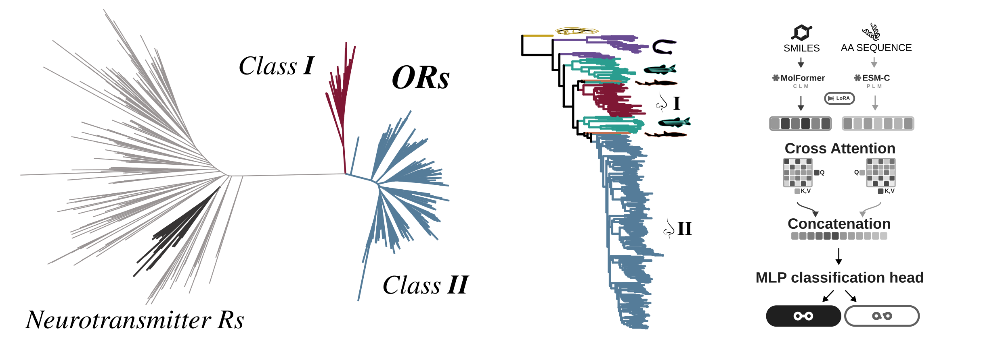

# Gene duplication shaped the origin and evolution of the vertebrate olfactory combinatorial code

This repository contains all necessary scripts to reproduce the analysis presented in [Zirdeli et al., 2026 (bioRxiv)](https://doi.org/10.64898/2026.08.31.747588).

A model trained on measured receptor–odorant bioassays predicts a binding probability for
every receptor × odorant pair. 



---

## Running it

```bash
git clone https://github.com/cgenomicslab/olfactory-receptors.git
cd olfactory-receptors

conda env create -f environment.yml         
conda activate olfactory-receptors

python scripts/download_zenodo_data.py      
python scripts/check_reproducibility.py     
```

---

## What is where

```
Data/                  the M2OR bioassay pairs, as downloaded
Model_Inputs/          what the model reads: the modelling table, and the embeddings
Phylogenetic_Analysis/ alignments and trees                        
Ancestral_Receptor_
  Reconstruction/      the 432 reconstructed ancestral sequences
Downstream_Analysis/   what the predictions say                      
Chemicals/chemspace/   odorants against a natural-product background 
scripts/               download, checks, and the figure/table builders
```

---

## The data flow

```
   M2OR bioassays                        odorant SMILES
   (52,175 pairs)                        (754 molecules)
         |                                      |
         v                                      v
  receptor sequences  --> ESM-C 300M      MolFormer
         |                (960-d)          (768-d)
         |                    \              /
         |                     \            /
   Phylogenetic_Analysis         [ binding model ]  -- 5 runs
   433 human ORs                        |
         |                              v
         v                    median probability per pair
   Ancestral_Receptor_               /        \
   Reconstruction         ASR matrix          reference matrix
   432 nodes              (432 x 754)         (584 x 754)
                                   \          /
                                    v        v
                              Downstream_Analysis
```

---

## Data and citation

Large files are archived on Zenodo at
[10.5281/zenodo.22178953](https://doi.org/10.5281/zenodo.22178953), with a SHA-256 for each
in [`zenodo_manifest.json`](zenodo_manifest.json). `download_zenodo_data.py` checks them on
arrival.

Code is released under [`LICENSE`](LICENSE).
